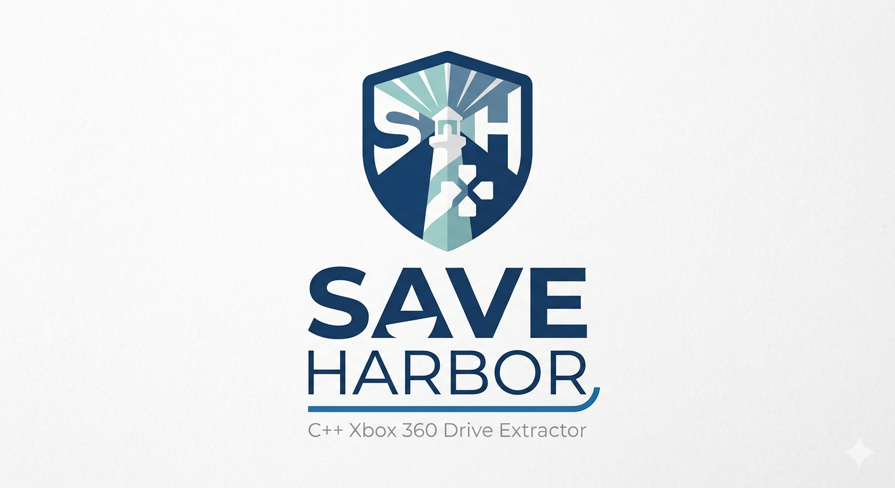

# SaveHarbor Xbox360 data extractor

  

SaveHarbor is a tool written in c++, it aims to the detection of save game files of an xbox360, finding them and making them extractable so you can play them with an emulator (Ex. Xenia), it's still in early development since I'm making this alone, once i finsih with the xbox360 i might try to develop a program for the ps3 too.

## Installing

You can install SaveHarbor by first cloning the repo:
~~~bash
git clone https://github.com/DPFschermo/SaveHarbor.git
cd Saveharbor
mkdir build && cd build
sudo cmake
make
~~~

## Usage
Using SaveHarbor is pretty simple:
~~~bash
cd build
./saveharbor /path/to/xboxhdd (Ex. /dev/sda)
~~~

## Status
Xbox 360: In development
Ps3: Planned

## WARNING
Again, I repeat, SaveHarbor is still in early development, so the scan might take a while and not all games are detected, i'm still unsure if the extracted files are playable, if you encounter bugs please contact me

